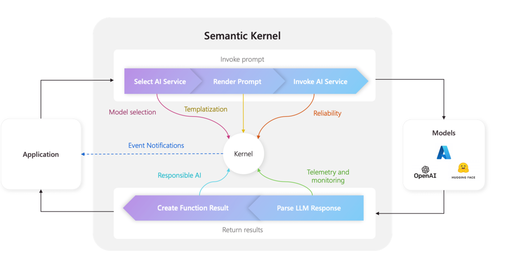

# Aplicação de Chats e Configurações API

## Como chamar o objeto (API Azure OpenAI)
Instânciando o objeto AzureOpenAI para consumir a API.
```python
    client = AzureOpenAI(
        azure_endpoint=os.getenv("AZURE_OPENAI_ENDPOINT"), 
        api_key=os.getenv("AZURE_OPENAI_API_KEY"), 
        api_version=os.getenv("AZURE_OPENAI_API_VERSION")
    )

```

### Rota POST
```python
POST https://{your_endpoint}/openai/deployments/{deployment-id}/completions?api-version=2024-10-21

{
    "prompt": ['tell me a joke about mango'],
    "max_tokens": 32,
    "temperature": 1.0,
    "n":1
}

```
Faz uma requisição à API do Azure OpenAI usando o endpoint que o usuário criou na plataforma.
Parâmetros:
- **prompt:** texto de entrada recebido pelo modelo;
- **max_tokens:** quantidade de tokens que a resposta terá;
- **temperature:** criatividade da resposta;
- **n:** número de respostas a serem geradas.
### Chat

```python
    res = client.chat.completions.create(
        model=os.getenv("AZURE_OPENAI_DEPLOYMENT_NAME"),
        messages=messages,
        temperature=0.7
    )
```
Dentro de `res` estará o resultado do chat criado através de completions.
Parâmetros:
 - **model:** nome do deployment feito no playground;
 - **messages:** uma lista de dicionários - de dois pares de chave-valor cada - que representa o log da conversa:
    ```python 
        messages = [
        {"role": "system", "content": "Você é um assistente útil."},
        {"role": "user", "content": "Qual é a capital da França?"},
        {"role": "assistant", "content": "A capital da França é Paris."},
        {"role": "user", "content": "E da Alemanha?"}
        ]
    ```
 - **temperature:** indica o quão criativo o modelo será na escolha de sua próxima palavra, no caso 70%.

### Imagem
```python
    response = client.images.generation(
        model="dall-e-3",  #ou seu modelo configurado
        prompt=prompt,
        n=1,
        size="1024x1024"
    )
```

Parâmetros: 
- **model:** indica qual modelo gerador de imagem será usado;
- **prompt:** descrição da imagem a se gerar, feita pelo usuário;
- **n:** número de imagens geradas pelo modelo;
- **size:** tamanho da imagem gerada.

## Semantic Kernel

### O que é e para que serve
Semantic Kernel (SK) é uma ferramenta de código aberto da Microsoft que visa facilitar a integração de modelos de IA em aplicações. Combinando modelos LLM com programação tradicional, é possível criar fluxos de trabalho que mistura às chamadas a APIs como da Azure OpenAI com código estruturado, podendo fazer uso de funções definidas através desse.

### Que problema resolve 
Facilita a integração entre os modelos de IA, funções de código e memória dentro de um mesmo sistema. Dentre as capacidades dessa ferramenta, pode-se destacar:
- Executar **funções da IA** (ex: geração de texto, análise de sentimentos, etc);
- Integrar **funções nativas do código** (Python/C#/Js para cálculos ou regras de negócio);
- Criar **memórias persistentes** que armazena e recupera dados da conversa;
- Gerenciar **fluxos de trabalho complexos** de forma mais eficiente.

#### Gerenciamento de memória sem o SK
O mecanismo de **memória semântica** do SK permite armazenar, recuperar e associar informações ao longo do tempo. Isso é essencial para manter contexto em aplicações como chatbots e agentes.
Sem essa memória, cada interação com a IA é isolada, o modelo não se recordará das anteriores. O que gera uma experiência menos personalizada e eficiente.

##### O que o SK armazena
Dentre os diversos tipos de dados que o sistema armazena, pode-se destacar:
- **Histórico de conversas** – Permite que a IA lembre de mensagens anteriores e mantenha um diálogo mais coerente.
- **Resumos de conteúdo** – Captura ideias principais de documentos, e-mails ou transcrições.
- **Embeddings de texto** – Representações numéricas que permitem buscas semânticas (ou seja, buscar por significado em vez de palavras exatas).
- **Dados contextuais do usuário** – Preferências, informações de perfil, interesses e interações passadas.

### Arquitetura

